# 使用宝塔面板部署

使用宝塔面板部署淼迈云收银企业版
1、 先安装宝塔面板
https://www.bt.cn/ 根据宝塔官网指引先在服务器上安装好宝塔面板
进入宝塔面板后执行以下步骤
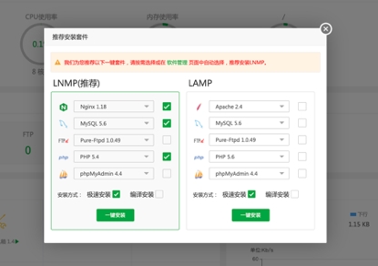

2、添加站点，输入预先在淼迈云已经授权好的域名，注意创建站点时的PHP版本，填好后点击提交

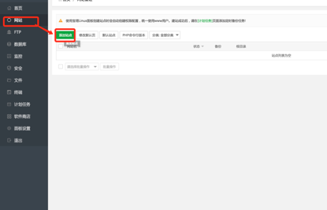
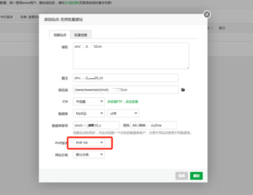
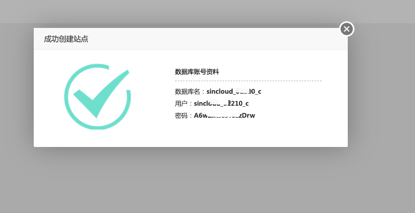

3、登录http://www2.miaomaiyun.com 下载安装包


4、把新建的站点根目录下的以下文件删掉

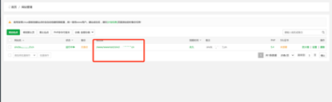

5、删掉后，然后将下载的安装包上传到宝塔面板上的网站管理文件中

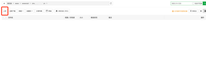

6、上传完之后点击解压

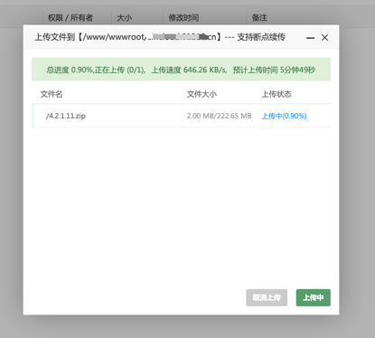
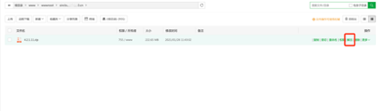

7、解压完毕后设置网站运行目录，如下图

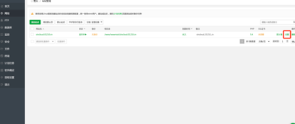
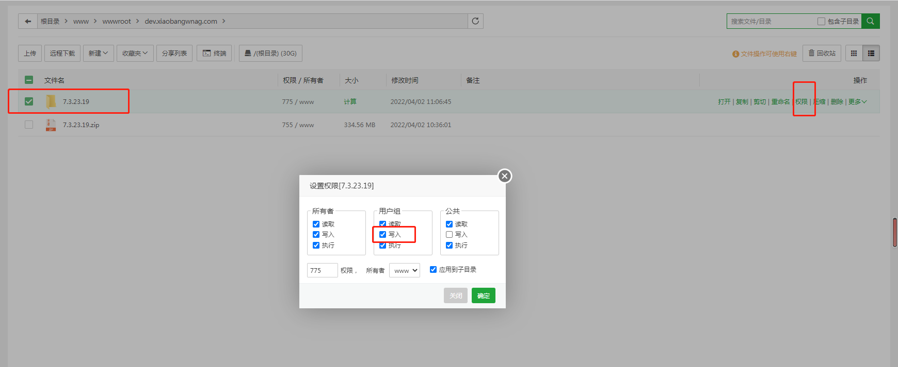
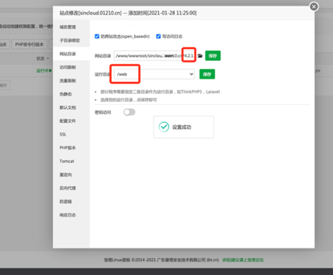

8、将下面的伪静态代码复制网站的配置中（适用于nginx），如下图
```
location / {
           index  index.html index.php;
           if (-e $request_filename) {
                    break;
               }
            if (!-e $request_filename) {
                   rewrite ^/(.*)$ /index.php/$1 last;
                  break;
               }
       }
location /wss {
      proxy_pass http://127.0.0.1:9282;
      proxy_http_version 1.1;
      proxy_set_header Upgrade $http_upgrade;
      proxy_set_header Connection "Upgrade";
      proxy_set_header X-Real-IP $remote_addr;
    }
```

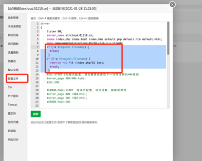

9、申请证书，填写自己对应的域名申请SLL证书

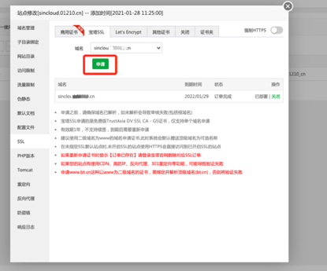
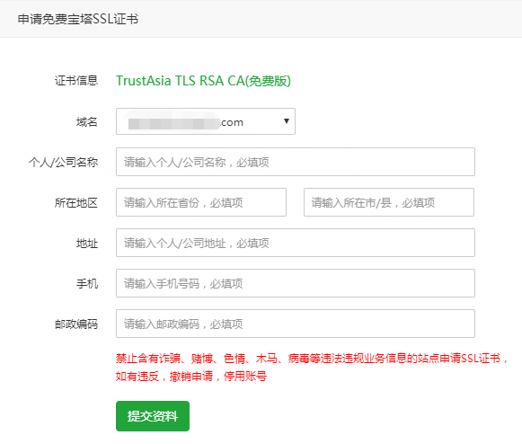

10、打开软件商店，找到PHP-5.4，点设置，安装拓展ZendGuardLoader和fileinfo

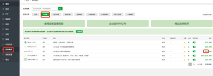
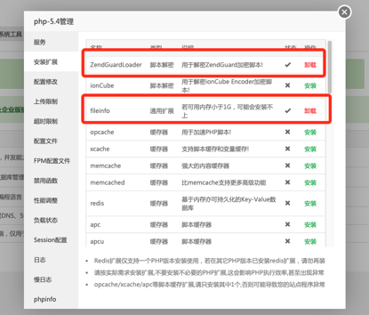
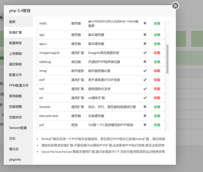


11、修改配置文件和超时限制

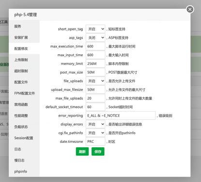
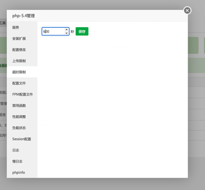

12、将这个加在配置文件里面，如下图
```
max_input_vars = 20000
```
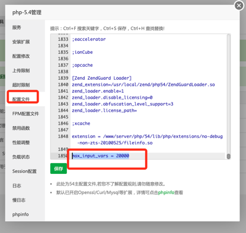

13、清空禁用函数

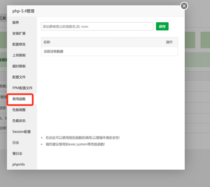

14、修改mysql的my.ini配置文件，将这个复制并替换到配置修改文件里面，如下图
```
sql-mode=STRICT_TRANS_TABLES,NO_ZERO_IN_DATE,NO_ZERO_DATE,ERROR_FOR_DIVISION_BY_ZERO,NO_AUTO_CREATE_USER,NO_ENGINE_SUBSTITUTION
```

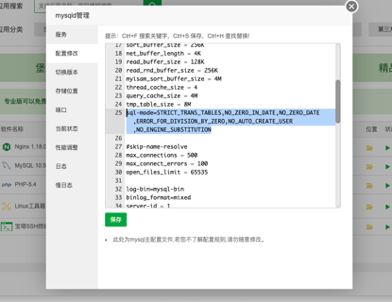

15、访问之前绑定的域名，即可正常访问淼迈云收银系统，根据提示完成以下安装步骤

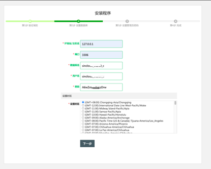
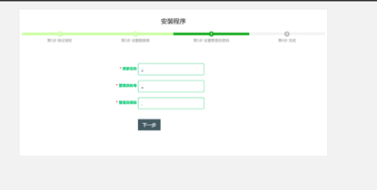